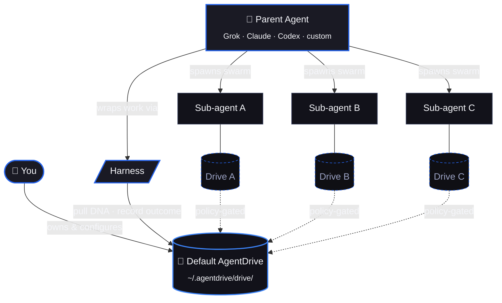

<div align="center">
  
</div>

<p align="center">
  <a href="https://github.com/PabloTheThinker/AgentDrive/actions"></a>
  <a href="#license"></a>
  <a href="#quickstart"></a>
  <a href="https://vektraindustries.com/agentdrive"></a>
</p>

<h1 align="center">AgentDrive</h1>

<p align="center">
  <b>Local-first storage for AI agents.</b><br>
  Every agent and every sub-agent owns its own persistent Drive — memory,<br>
  proven patterns, accumulated experience — so it can rebuild itself,<br>
  resume work, and learn without a parent micromanaging every step.<br>
  <br>
  <b>Local. Private. Yours.</b>
</p>

<p align="center">
  <a href="#quickstart"><b>Install</b></a> ·
  <a href="#how-it-works"><b>How it works</b></a> ·
  <a href="#architecture"><b>Architecture</b></a> ·
  <a href="docs/SWARM.md"><b>Swarms</b></a> ·
  <a href="docs/POOL.md"><b>Drive</b></a>
</p>

---

## What AgentDrive is

ProtonDrive backs up your files locally, with end-to-end privacy, and gives you the keys.

**AgentDrive does the same thing for your AI agents.**

Every agent's memory, every sub-agent it spawns, every reasoning pattern that ever worked — all of it lives in a Drive on your disk. Plain text and SQLite. No cloud account. No vendor lock-in. The agent doesn't have to ask its parent what to do next; it consults its own Drive first.

When an agent crashes, restarts, or gets swapped out for a new model, the Drive is what brings it back.

---

## How it works

<table>
<tr>
<td width="33%" valign="top">

### A Drive per agent
Every agent and every sub-agent it spawns gets its own private, persistent Drive under `~/.agentdrive/drive/`. The Drive holds the agent's DNA — memory, patterns, outcomes — and survives crashes, restarts, and full model replacement.

</td>
<td width="33%" valign="top">

### Self-reconciling
Sub-agents pull from their own Drive on a routine they run themselves. No orchestrator handholding. When new DNA lands — from their own work, a peer's contribution, or a parent's update — they absorb it on the next tick.

</td>
<td width="33%" valign="top">

### User sovereign
Settings, isolation policy, sharing rules, retention — all user-controlled. No telemetry. Plain-text storage you can `cat`, `grep`, `git`, encrypt, or wipe at any time. Override any policy by editing one YAML file.

</td>
</tr>
</table>

---

## Quickstart

```bash
curl -fsSL https://vektraindustries.com/agentdrive/install | bash
agentdrive
```

The installer verifies Python ≥ 3.11, installs AgentDrive, wires your PATH (bash / zsh / fish), creates `~/.agentdrive/`, and offers to launch the TUI.

<details>
<summary><b>Manual install</b></summary>

```bash
python3 -m pip install --user git+https://github.com/PabloTheThinker/AgentDrive.git
export PATH="$HOME/.local/bin:$PATH"
agentdrive
```

</details>

<details>
<summary><b>Verify</b></summary>

```bash
agentdrive doctor          # health check
agentdrive drive status    # your Drive overview
agentdrive genomes list    # what your agents have learned
```

</details>

<details>
<summary><b>Spawn a swarm — give each sub-agent its own Drive</b></summary>

```python
import os
from agentdrive import Harness, AgentDrive
from agentdrive.constants import get_swarm_drive_path

swarm_id = os.getenv("AGENTDRIVE_SWARM_ID", "demo-swarm")
sub_id   = os.getenv("AGENTDRIVE_SUBAGENT_ID", "worker-1")

# Each sub-agent gets an isolated Drive at
# ~/.agentdrive/swarms/<swarm-id>/<sub-id>/drive/
drive   = AgentDrive(drive_path=get_swarm_drive_path(swarm_id, sub_id))
harness = Harness(agent_id=f"{swarm_id}:{sub_id}", pool=drive)

with harness.task_context("Your sub-task here"):
    enriched = harness.inject_into_context(base_prompt)
    result   = do_your_work(enriched)
    harness.record_outcome(result)
```

Full walkthrough in [`docs/SWARM.md`](docs/SWARM.md).

</details>

---

## See it

<div align="center">
  
  <br><sub><b>Drive status.</b> Genomes loaded, active swarms, sub-agent Drives, runs ingested. All local. All yours.</sub>
</div>

<br>

<div align="center">
  
  <br><sub><b>Mission Board.</b> Every piece of work an agent commits to — tracked across lanes with full provenance.</sub>
</div>

---

## Architecture



Three primitives:

1. **`AgentDrive`** — the persistent store of an agent's Genomes, embeddings, and run history. One per scope (default, swarm, sub-agent).
2. **`Harness`** — the lightweight adapter any agent wraps its work with. Pulls relevant DNA on task start, records outcomes on completion, runs the reconciliation routine that lets the agent absorb new entries from its own Drive without parent intervention.
3. **Sharing policies** — sub-agent Drives can stay private, sync upward to a swarm Drive, or contribute to the default Drive. Federation across trusted peer Drives is opt-in and quarantine-gated. You decide per-swarm.

---

## Why AgentDrive

Most agent setups rediscover the same patterns in every run, in every codebase, in every team. Skills live in prompts. Memory dies at the end of the conversation. Sub-agents need a parent to tell them what to do every time, because they have no continuity of their own.

AgentDrive treats agent capability the way ProtonDrive treats your files — except local instead of cloud:

- **Local-first** — your Drive lives on your disk, in plain text and SQLite. No cloud account. No vendor.
- **Privacy-absolute** — nothing leaves the machine unless you opt in to peer federation, and peer DNA always lands in quarantine before it can affect anything.
- **You own it** — `cat`, `grep`, `git`, encrypt, back up, or wipe it at any time. It's just files.
- **Per-agent continuity** — every agent and sub-agent has its own Drive. They consult their own memory before asking up the chain.
- **Crash-recoverable** — when an agent dies, its Drive is what brings the next instance up to speed.

This is the memory and continuity layer above your orchestrator — not another orchestrator.

---

## Compatibility

| Platform | Status |
|---|---|
| Linux | ✅ Full support |
| macOS | ✅ Full support |
| Termux (Android) | ✅ Works (no heavy browser extras) |
| Windows | ⚠️ Use WSL2 or Git Bash + Python |

Works as a sidecar to **Grok Build**, **Claude Code**, **Codex**, **MCP**, and any custom orchestrator. Adapters in `agentdrive.workers.adapters`.

---

## Docs

| | |
|---|---|
| **[`VISION.md`](VISION.md)** | AgentDrive long-term framing — Drive for every agent, owned by you |
| **[`ARCHITECTURE.md`](ARCHITECTURE.md)** | Full system map and design rationale |
| **[`GENOME-SPEC.md`](GENOME-SPEC.md)** | Genome schema, versioning, and provenance |
| **[`docs/RECOVERY.md`](docs/RECOVERY.md)** | The healing loop — how a Drive resurrects a dead agent |
| **[`docs/SWARM.md`](docs/SWARM.md)** | Swarm spawning, isolation, sharing policies |
| **[`docs/POOL.md`](docs/POOL.md)** | Drive layout, queries, and lifecycle |
| **[`docs/POOL-EVOLUTION.md`](docs/POOL-EVOLUTION.md)** | Federated learning stack — confidence, inheritance, quarantine, peers, reconciliation |
| **[`docs/SETTINGS.md`](docs/SETTINGS.md)** | Every config knob, with defaults |
| **[`docs/INTEGRATION.md`](docs/INTEGRATION.md)** | Wrapping your agent in `Harness` |
| **[`CHANGELOG.md`](CHANGELOG.md)** | Release notes — including the AgentDrive pivot |
| **[`SECURITY.md`](SECURITY.md)** | Reporting vulnerabilities |
| **[`CONTRIBUTING.md`](CONTRIBUTING.md)** | How to ship Genomes, scanners, and adapters |

---

## Status

Early foundation. Shipping in the open. Mission Board, Drive browser, swarm dispatch, and external adapter system are live in the TUI today. Public Genome registry, evolutionary scanners, and PyPI release are next.

Built by [Vektra Industries](https://vektraindustries.com). Internal federated-learning engine credited as Savant — lives inside `agentdrive.*` for contributors.

## License

MIT.
