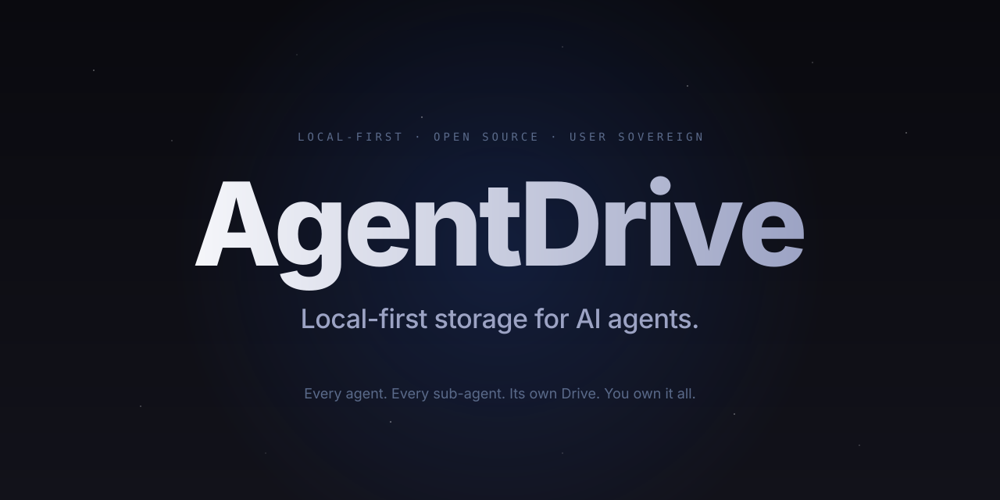
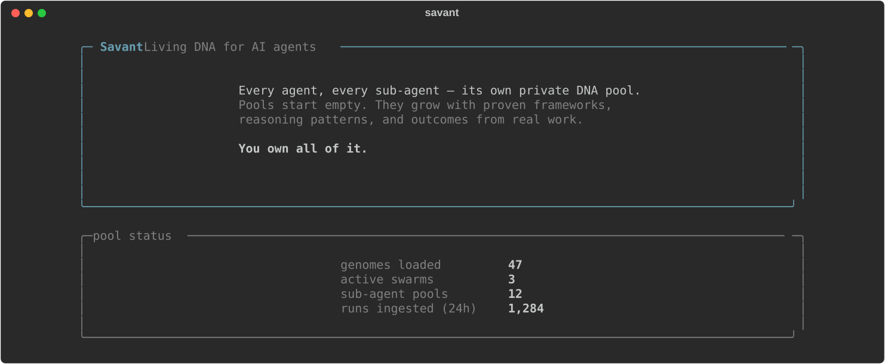
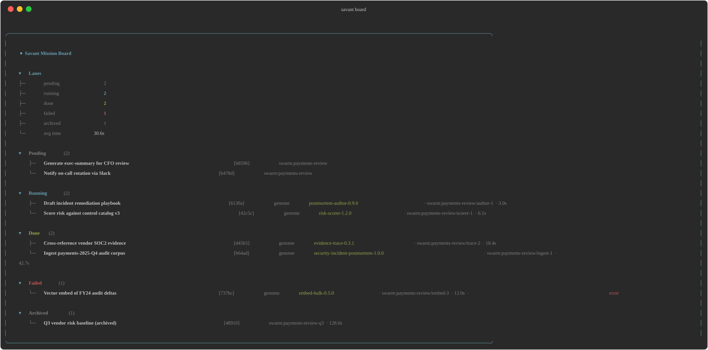
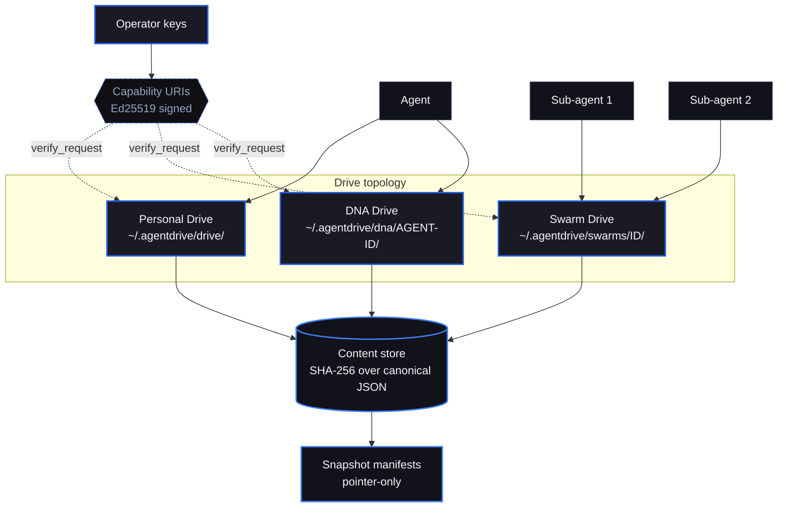

<div align="center">
  
</div>

<p align="center">
  <a href="https://github.com/PabloTheThinker/AgentDrive/actions/workflows/ci.yml"></a>
  <a href="#license"></a>
  <a href="#quickstart"></a>
  <a href="https://vektraindustries.com/agentdrive"></a>
</p>

<h1 align="center">AgentDrive</h1>

<p align="center">
  <b>Local-first storage for AI agents.</b><br>
  Three Drive tiers — Personal, Swarm, DNA — over one content-addressed object store,<br>
  mediated by signed capability URIs, with pointer-only snapshot backup.<br>
  No cloud account. No vendor. You hold the keys.
</p>

<p align="center">
  <a href="#quickstart"><b>Install</b></a> ·
  <a href="#whats-in-the-box"><b>What's in the box</b></a> ·
  <a href="#architecture"><b>Architecture</b></a> ·
  <a href="#capability-uris"><b>Capabilities</b></a> ·
  <a href="#snapshot-backup"><b>Backup</b></a> ·
  <a href="#documentation"><b>Docs</b></a>
</p>

---

## Overview

AgentDrive is a local-first storage substrate for AI agents. It holds the artifacts an agent accumulates over time — proven patterns (genomes), embeddings, run history, sub-agent state, and inherited DNA from peer agents — on the operator's own machine, with explicit, signed authorization for every access.

The design borrows two postures: the privacy posture of end-to-end encrypted personal storage, and the identity posture of content-addressed systems. An agent's continuity does not depend on a cloud service or a vendor SDK; it depends on a directory tree, a SQLite database, and a keypair the operator controls.

AgentDrive is intended to sit beneath an orchestrator — not to replace one. It is the memory and continuity layer that an agent runtime can rely on, regardless of the model, harness, or orchestration framework in use.

---

## Quickstart

```bash
curl -fsSL https://vektraindustries.com/agentdrive/install | bash
agentdrive
```

The installer verifies Python ≥ 3.11, installs AgentDrive, wires the user's PATH (bash / zsh / fish), creates `~/.agentdrive/`, and offers to launch the TUI.

Manual install:

```bash
python3 -m pip install --user git+https://github.com/PabloTheThinker/AgentDrive.git
export PATH="$HOME/.local/bin:$PATH"
agentdrive
```

Requirements and platform support:

- **Python:** 3.11+
- **Full support:** Linux, macOS
- **Also works:** Termux
- **Windows:** via WSL2

Verify the installation:

```bash
agentdrive doctor
agentdrive drive status
agentdrive genomes list
```

---

## Operational view

<div align="center">
  
  <br><sub>Drive status overview: local genomes, active swarms, sub-agent Drives, and ingested runs.</sub>
</div>

<br>

<div align="center">
  
  <br><sub>Mission Board: task flow with provenance across pending, running, done, failed, and archived work.</sub>
</div>

---

## What's in the box

All components below ship in **v0.1.0** and are exercised by tested code paths. Current local verification: `pytest -q` passes, `ruff check src tests` is clean, CI runs pytest/ruff/CodeQL, and mypy is configured as an informational CI check. In this local checkout, `mypy` is not installed, so it is not claimed as a local green gate.

| Component | Modules | Shipped behavior |
|---|---|---|
| **Three-tier Drive topology** | `agentdrive.drive`, `agentdrive.drive.swarm_manager`, `agentdrive.dna` | Personal Drive at `~/.agentdrive/drive/`; one shared Swarm Drive per swarm at `~/.agentdrive/swarms/<id>/`; DNA Drives at `~/.agentdrive/dna/<agent-id>/`. DNA lineage is stored as a forward-only SQLite closure table: `(ancestor_id, descendant_id, min_depth)`. |
| **Content-addressed object store** | `agentdrive.drive.content_store` | Objects are named by SHA-256 of canonical JSON and sharded as `objects/<aa>/<rest>.json`. Writes are atomic via temporary file + `os.replace`. Identical genomes deduplicate across every Drive on the machine. |
| **Capability URIs** | `agentdrive.cap.uri.Capability`, `agentdrive.cap.store.CapStore` | Capabilities use the format `<resource>:<action>:<scope>[:<param>=<value> ...]`, are Ed25519-signed, TTL-bounded, and verified through a single chokepoint: `CapStore.verify_request(cap, op, scope)`. |
| **Lineage grants** | `agentdrive.dna.grants.LineageShareGrant` | Cross-agent DNA inheritance with signed, TTL-bounded grants and scope controls such as `max_hops` and `min_eval`. Received DNA lands in quarantine before use. |
| **Snapshot backup** | `agentdrive.backup.snapshot.SnapshotManager`, `agentdrive.backup.ui` | Pointer-only snapshot manifests store hashes, not copied bytes. Default cadence is 6 hours with rolling retention of 6 hourly, 7 daily, 4 weekly, plus pinned snapshots. Restore is read-only and returns hashes. The older localhost snapshot UI on `:8420` is legacy while its controls are absorbed into the FastAPI web surface. |
| **Harness** | `agentdrive.harness` | The runtime wrapper for adapter agents. Pulls relevant DNA at task start and records outcomes at task end. |
| **Adapters** | `agentdrive.workers.adapters` | Sidecar integrations for Grok Build, Claude Code, Codex, MCP, and custom orchestrators. |
| **Web surface** | `agentdrive.web` | FastAPI + Jinja2 dashboard. Launch with `agentdrive web` and open `http://127.0.0.1:8421`. Auth (Argon2id, admin-approval signup, 5-failure rate limit, Origin-checked CSRF), dashboard, Personal/Swarms/DNA/Snapshots/Capabilities/Peers, and admin user management all ship. Interactive flows: mint/revoke capability, import genome, spawn swarm, take/pin/restore/delete snapshot, issue lineage grant, add peer, approve/reject quarantine. Health probe at `/healthz`, JSON request logs with `request_id`. |

---

## Architecture

AgentDrive separates private work, shared swarm coordination, and long-lived inheritance into three distinct tiers. Underneath those tiers is one machine-local, content-addressed store. Access is mediated by signed capabilities rather than ambient trust.



### Tier model

| Tier | Path | Purpose |
|---|---|---|
| **Personal Drive** | `~/.agentdrive/drive/` | Default scope for private agent state: genomes, embeddings, run history, settings, and local work products. |
| **Swarm Drive** | `~/.agentdrive/swarms/<id>/` | One shared substrate per swarm. All sub-agents in the swarm read and write the same Drive, enabling stigmergic coordination without a parent acting as a message bus. |
| **DNA Drive** | `~/.agentdrive/dna/<agent-id>/` | Long-lived inheritance layer. Once DNA crosses into a descendant lineage, provenance is preserved and the ancestry graph moves forward only. |

### Design rationale

- **Three tiers instead of one:** different lifecycles require different storage boundaries. Private state, shared coordination, and inherited lineage are not the same class of data.
- **Content addressing instead of path identity:** a genome is identified by its content hash, not where it was written. Identity is a property of the object itself.
- **Capabilities instead of ambient access:** authorization is explicit, signed, TTL-bounded, and checked through one verification path.
- **Pointer-only backup:** snapshots reference hashes already present in the content store, reducing backup cost and preserving integrity semantics.

---

## Capability URIs

Every Drive operation is authorized through a single verification chokepoint:

```python
CapStore.verify_request(cap, op, scope)
```

Capability format:

```text
<resource>:<action>:<scope>[:<param>=<value> ...]

drive:read:swarm:demo
drive:write:personal
dna:pull:lineage:agent-7:max_hops=3:min_eval=0.7
backup:read:agent:agent-12
```

Properties of the capability system:

- **Ed25519 signatures** against the issuer keypair
- **TTL-bounded validity**
- **Subset minting and derivation**
  - write covers read
  - exec covers all
  - full scope covers narrower parametric scope
- **Revocation by expiry**
  - operationally, revocation is the absence of re-mint
  - capabilities expire on their own clock

Example:

```python
from agentdrive.cap.store import CapStore
from agentdrive.cap.uri import Capability

store = CapStore()

cap = store.mint(
    Capability.parse("drive:read:swarm:demo"),
    ttl_seconds=3600,
)

assert store.verify_request(cap, "read", "swarm:demo")
print(cap.to_token())
```

The important constraint is architectural, not cosmetic: authorization does not drift across multiple ACLs or secondary policy files. If the capability verifies for the requested operation and scope, the request is authorized. If it does not, it is not.

---

## Swarm Drives and the Harness

Swarm Drives are a shared substrate for sub-agents working on the same problem. Rather than serializing all coordination through a parent process, sub-agents write to and read from a common Drive. This is a stigmergic pattern: shared state carries forward useful work.

Example:

```python
from agentdrive.drive.swarm_manager import SwarmDriveManager
from agentdrive.harness import Harness

def run_worker(sub_id: str, task: str) -> None:
    manager = SwarmDriveManager()
    swarm_drive = manager.get_or_create_pool("demo-swarm")

    harness = Harness(
        agent_id=f"demo-swarm:{sub_id}",
        pool=swarm_drive,
    )

    with harness.task_context(task):
        prompt = harness.inject_into_context("Summarize repository state.")
        result = {
            "status": "ok",
            "preview": prompt[:120],
        }
        harness.record_outcome(result)

for sub_id in ("worker-1", "worker-2", "worker-3"):
    run_worker(sub_id, "inspect repository")
```

Operationally:

- all workers in the same swarm use the same Drive
- proven genomes become immediately available to peer workers
- swarm learning is shared without copying or reconciling multiple local stores

See [`docs/SWARM.md`](docs/SWARM.md) and [`docs/INTEGRATION.md`](docs/INTEGRATION.md) for the integration model.

---

## DNA inheritance and lineage grants

DNA Drives model persistent inheritance between agents. The ancestry graph is implemented as a forward-only SQLite closure table:

```text
(ancestor_id, descendant_id, min_depth)
```

This makes lineage queryable and provenance-preserving. Inheritance does not mutate the donor's history; it extends the recipient's ancestry.

Cross-agent inheritance is mediated by signed lineage grants with explicit scope controls:

- `max_hops`
- `min_eval`
- TTL bounds
- recipient identity
- quarantine on receipt

Example:

```python
from agentdrive.dna.drive import DNADrive

donor = DNADrive("agent-7")
recipient = DNADrive("agent-12")

grant = donor.issue_grant(
    recipient_id="agent-12",
    max_hops=3,
    min_eval=0.7,
    ttl_seconds=86_400,
)

recipient.inherit_from(donor, grant)
```

What this enforces:

- inheritance is **forward-only**
- provenance is retained with the inherited DNA
- imported DNA lands in **quarantine first**
- evaluation thresholds and hop limits bound blast radius

For the full model, see [`docs/AGENTDRIVE-V2-INHERITANCE.md`](docs/AGENTDRIVE-V2-INHERITANCE.md).

---

## Content-addressed storage

The content store is the machine-local substrate shared by every Drive tier.

Key properties:

- **Identity by hash:** SHA-256 of canonical JSON
- **Sharded layout:** `objects/<aa>/<rest>.json`
- **Atomic writes:** temporary file + `os.replace`
- **Machine-wide deduplication:** identical genomes converge to one object

This matters for both performance and correctness:

- two agents that learn the same genome converge on the same stored object
- snapshots become compact manifests of hashes
- integrity checks are straightforward because object identity is deterministic

See [`ARCHITECTURE.md`](ARCHITECTURE.md) and [`GENOME-SPEC.md`](GENOME-SPEC.md) for the underlying data model.

---

## Web And Snapshot UI

AgentDrive's public web direction is the FastAPI + HTMX operator surface:

```bash
agentdrive web
# http://127.0.0.1:8421
```

The current web surface is intentionally early: local setup/login, session-backed auth, a dashboard shell, and admin user approval. The next work is Phase 2+ integration of Drive, Swarms, DNA, Snapshots, Capabilities, and Peers.

The old stdlib snapshot control UI on `:8420` remains a legacy/snapshot-specific surface until those controls are folded into the FastAPI app. Treat `127.0.0.1:8421` as the forward path.

## Snapshot backup

Snapshot backup is designed around references, not duplication. A snapshot manifest is a JSON record of the hashes that defined a Drive at a point in time. The content bytes remain in the shared content store.

Shipped behavior:

- **Default cadence:** every 6 hours
- **Retention:** 6 hourly, 7 daily, 4 weekly, plus pinned snapshots
- **UI:** legacy snapshot UI on localhost `:8420`; new FastAPI web direction at `http://127.0.0.1:8421`
- **Restore mode:** read-only; returns hashes and lets the caller decide what to rebuild

Security hardening in the shipped UI includes:

- Origin/Referer CSRF checks
- `X-Frame-Options: DENY`
- `Content-Security-Policy: frame-ancestors 'none'`
- strict identifier whitelist for every filesystem-bound identifier:
  - `[A-Za-z0-9._:-]{1,128}`

The recovery model is deliberate: snapshot tooling does not silently overwrite live state. It produces verifiable references; the caller performs the rebuild.

See [`docs/RECOVERY.md`](docs/RECOVERY.md), [`SECURITY.md`](SECURITY.md), and [`SECURITY-HARDENING.md`](SECURITY-HARDENING.md).

---

## Compatibility

| Platform | Status |
|---|---|
| Linux | Full support |
| macOS | Full support |
| Termux | Supported |
| Windows | Use WSL2 |

AgentDrive is designed to run as a sidecar or substrate for:

- Grok Build
- Claude Code
- Codex
- MCP
- custom orchestrators

Integration adapters live in [`src/agentdrive/workers/adapters.py`](src/agentdrive/workers/adapters.py).

---

## Documentation

### Core design

| Document | Description |
|---|---|
| [`VISION.md`](VISION.md) | Long-term framing and product direction |
| [`ARCHITECTURE.md`](ARCHITECTURE.md) | System map, storage model, and design rationale |
| [`GENOME-SPEC.md`](GENOME-SPEC.md) | Genome schema, versioning, and provenance |

### Topology, lineage, and swarm behavior

| Document | Description |
|---|---|
| [`docs/AGENTDRIVE-V2.md`](docs/AGENTDRIVE-V2.md) | Three-tier topology: Personal, Swarm, DNA |
| [`docs/AGENTDRIVE-V2-INHERITANCE.md`](docs/AGENTDRIVE-V2-INHERITANCE.md) | DNA inheritance, ancestry DAG, and lineage grants |
| [`docs/SWARM.md`](docs/SWARM.md) | Swarm lifecycle, sharing model, and coordination behavior |
| [`docs/POOL.md`](docs/POOL.md) | Drive layout, queries, and lifecycle |
| [`docs/POOL-EVOLUTION.md`](docs/POOL-EVOLUTION.md) | Evolutionary and federated learning model |

### Operations and integration

| Document | Description |
|---|---|
| [`docs/RECOVERY.md`](docs/RECOVERY.md) | Recovery model and agent resurrection workflow |
| [`docs/SETTINGS.md`](docs/SETTINGS.md) | Configuration surface and defaults |
| [`docs/INTEGRATION.md`](docs/INTEGRATION.md) | Harness integration and adapter patterns |

### Security and project workflow

| Document | Description |
|---|---|
| [`SECURITY.md`](SECURITY.md) | Threat model, disclosure process, and hardening notes |
| [`SECURITY-HARDENING.md`](SECURITY-HARDENING.md) | Snapshot UI hardening and path-safety controls |
| [`CHANGELOG.md`](CHANGELOG.md) | Release history |
| [`CONTRIBUTING.md`](CONTRIBUTING.md) | Contribution workflow for genomes, scanners, and adapters |

---

## Status

**v0.1.0** is the initial public release.

Shipped and verified in this release:

- three-tier Drive topology
- content-addressed object store
- capability URIs
- lineage grants
- snapshot backup
- Harness integration
- adapters for external agent runtimes

Current quality gates:

- **pytest passes locally**
- **ruff clean for `src` and `tests` locally**
- **mypy configured as informational in CI; not installed in this local checkout**
- **CI exists for pytest/ruff and CodeQL**

Next planned milestones:

- FastAPI web Phase 2+ pages for Drive, Swarms, DNA, Snapshots, Capabilities, and Peers
- capability enforcement hardening across every user-facing path
- public naming cleanup where legacy Savant wording is still only historical/internal
- public Genome registry
- evolutionary scanners
- Docker/self-host demo
- PyPI release

---

## License

MIT.

Published by [Vektra Industries](https://vektraindustries.com), a four-division technology company spanning AI, Software, Robotics, and Communications.
