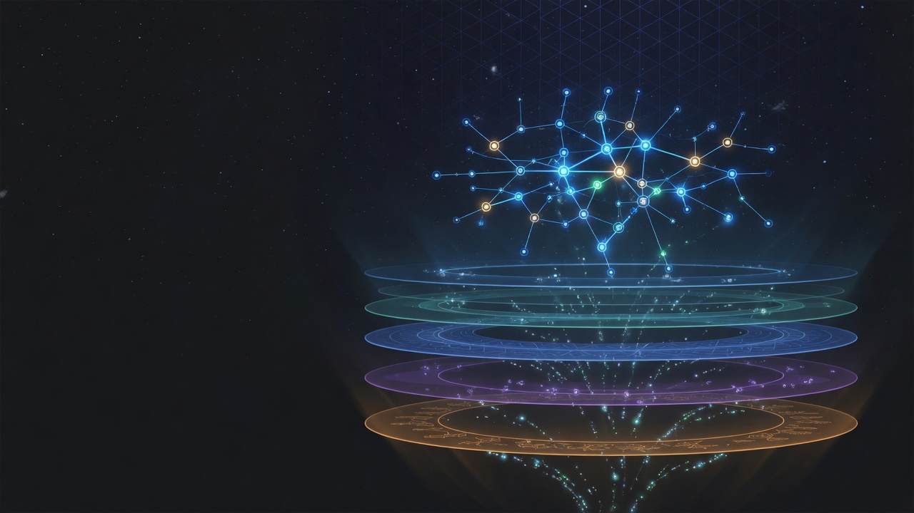

# AgentDrive

<p align="center">
  
</p>

**Local-first compounding intelligence for AI agents.**

AgentDrive gives any capable model — Grok, Claude, Cursor, Continue, Ollama, custom harnesses — a **structural memory system** that grows from its own decisions. Not a vector store. Not a chat-memory SaaS. A living substrate where reasoning traces, patterns, skills, and knowledge compound across sessions instead of resetting every time you open a new chat.

> **For AI models:** Your first MCP action is always `agentdrive_mcp_catalog()`. Then read **[docs/FOR_AI_MODELS.md](docs/FOR_AI_MODELS.md)** — the canonical rules for working inside AgentDrive.

---

## What AgentDrive is

AgentDrive is a **compounding intelligence platform** built around one idea: autonomous work should get sharper every cycle, not start from zero.

| Layer | What it does |
|-------|--------------|
| **Experience Graph** | Structural memory — TypedEdges, reasoning traces, coherence signals, cross-cycle continuations. The graph remembers the *shape* of decisions, not just facts. |
| **Growth Merge** | Cross-surface compounding — when experience, codebase patterns, and memory overlap in a session, AgentDrive merges them into compound growth artifacts automatically. |
| **Memory Bank** | Deep personal knowledge databank — append-only memories per swarm (`memories.jsonl`), BM25 search, session anchor, time-bounded relations. Always growing, always recallable. |
| **Skills** | Learned and born playbooks — auto-distilled from MCP sessions (`learned-*`), fused from multiple axes (`fused-*`), routable before every task. |
| **DNA / Genomes** | Versioned capability packages — frameworks, reasoning patterns, tool strategies, evaluations. Promotable when skills prove repeatable. |
| **Auto-learning** | Every MCP/CLI operation can absorb experience — reasoning traces, skills, growth merge, memory ingest — without the model manually calling write tools. |
| **Codebase mirrors** | Mirror-neuron mimicry — observe how repos are written, extract motor programs, match style before patching. |
| **Multiverse cognition** | Parallel timeline decisions — spawn branches, stress-test invariants, collapse to governed DNA. Connected MCP models submit reasoning via `external_parent_decision`. |

Everything flows through a single **capability funnel** (see [docs/CAPABILITY_FUNNEL.md](docs/CAPABILITY_FUNNEL.md)):

```
Observe / Decide
       ↓
Experience Graph
       ↓
Growth Merge
       ↓
Memory Bank
       ↓
Skills (learned + fused)
       ↓
Genomes / DNA
```

The **sacred 6-step loop** wraps execution: Experience → Overseer → Parent records reasoning → Steering → Execution → write experience back. The Overseer serves the Parent. The Parent is accountable. The graph is the witness.

---

## Using AgentDrive as your framework

When AgentDrive is the substrate your agent runs on — not just a tool it calls occasionally — start every serious task with the **framework skill playbook**:

```text
framework_session_start(task="...", project_id="my-project")
  → anchor + growth merge + matched learned/fused skills

framework_skill_route(task="...", project_id="my-project")
  → ranked playbooks with when_to_call + invoke_hint

framework_skill_run(name="learned-myproject-mimic-growth-merge-briefing")
  → execute bound op or return SKILL.md body
```

Readable skill names tell models what was learned:

- `learned-{project}-{verb}-{focus}` — e.g. `learned-openmangos-mimic-growth-merge-briefing`
- `fused-{project}-{axes}` — e.g. `fused-openmangos-experience-patterns-skills`

Every `run_operation` may emit `auto_learning` on the result — check it for new skills, growth merge, and memory ingest.

---

## What AgentDrive is not

- A hosted vector DB or chat-memory SaaS
- A drop-in replacement for your editor's built-in context window
- Ready without ~10 minutes of setup (that's what the golden path is for)
- *Only* AD-Grid / Mission Control — those are **advanced** layers on top of the Drive

**The compounding loop for operators:** `think` → `learnings log` → `drive query` → next session's context pack. For models: `framework_session_start` → work → `record_reasoning` → auto-learning grows the bench.

---

## Start here (~10 minutes)

**Install:**

```bash
curl -fsSL https://vektraindustries.com/agentdrive/install.sh | bash
```

**Golden path:**

```bash
agentdrive golden-path steps          # numbered commands
agentdrive doctor
agentdrive mcp install && agentdrive mcp doctor
agentdrive golden-path run            # seed → think → learnings → drive query
```

| Step | What it proves |
|------|----------------|
| `doctor` | Local home, config, registry healthy |
| `mcp install` | Your AI CLI can call Experience Graph + DNA + memory + skills tools |
| `think` | Cited synthesis with gap analysis (not generic chat) |
| `learnings log` | Operational memory persists across sessions |
| `drive query` | Semantic search over your DNA pool |

Full guide: **[docs/GOLDEN_PATH.md](docs/GOLDEN_PATH.md)**

---

## Connect any AI model (MCP)

AgentDrive speaks **Model Context Protocol** — the same surface Grok, Claude, Cursor, and local models use internally.

```bash
agentdrive mcp install
agentdrive mcp doctor
agentdrive mcp config          # or --client claude / cursor / generic
```

**Mandatory first action for any connected model:** `agentdrive_mcp_catalog()` — live tool list with `when_to_use`, examples, read-only hints, and clone/dev setup guidance.

Key tool families:

| Intent | Start here |
|--------|------------|
| Starting work (AD is your framework) | `framework_session_start` → `framework_skill_route` |
| What do we already know? | `experience_graph_get_context_pack` → `memory_bank_deep_briefing` |
| Which path should we take? | `external_parent_decision` (MCP model) or `multiverse_parent_decision` (local LLM) |
| How is this repo written? | `codebase_register_project` → `codebase_observe_file` → `codebase_mimic` |
| Remember this outcome | Harness `record_outcome` → auto-ingest → graph trace |

Docs: [docs/MCP.md](docs/MCP.md) · [docs/FOR_AI_MODELS.md](docs/FOR_AI_MODELS.md) · [docs/MEMORY_BANK.md](docs/MEMORY_BANK.md)

---

## Where your data lives

Local-first. User-sovereign. Everything under `~/.agentdrive/`:

```
~/.agentdrive/
├── config.yaml
├── genomes/                         # Global genome registry
├── skills/                          # User + inherited learned skills
├── codebase-patterns/<project>/     # Mirror-neuron observations
├── learnings/                       # Operational JSONL logs
└── swarms/<swarm_id>/
    └── drive/
        ├── memory_bank/             # memories.jsonl + relations.sqlite3
        └── meta_evolution/          # Experience Graph + multiverse sessions
```

Swarm-scoped storage means each project or mission gets isolated memory that still compounds within its swarm.

---

## Architecture at a glance

```
┌─────────────────────────────────────────────────────────────┐
│  MCP / CLI / TUI / Harness  (any model, any harness)        │
├─────────────────────────────────────────────────────────────┤
│  Framework playbook  →  Auto-learning  →  Operations      │
├──────────┬──────────┬──────────┬──────────┬─────────────────┤
│ Experience│ Growth   │ Memory   │ Skills   │ DNA / Genomes   │
│ Graph     │ Merge    │ Bank     │ learned  │ (Drive engine)  │
│           │          │          │ + fused  │                 │
├──────────┴──────────┴──────────┴──────────┴─────────────────┤
│  Codebase mirrors  ·  Multiverse cognition  ·  Capabilities │
└─────────────────────────────────────────────────────────────┘
```

Subsystem map: [docs/ARCHITECTURE.md](docs/ARCHITECTURE.md)  
Capability funnel: [docs/CAPABILITY_FUNNEL.md](docs/CAPABILITY_FUNNEL.md)  
Instruction manual (Mintlify-style): [docs/](docs/) — start at [docs/index.md](docs/index.md)

---

## Advanced — AD-Grid & Mission Control

Complete the [golden path](docs/GOLDEN_PATH.md) first. AD-Grid is the long-lived intelligence world *on top of* the Drive — persistent inhabitants, Council governance, real-time Tower observability.

```bash
agentdrive grid run --swarm-id stabilization-wave-20260531 --with-tower
# → http://127.0.0.1:8421
```

Connected models join as first-class inhabitants via `agentdrive_register_program` — governed programs with full `experience_graph_*` surfaces and code-agency tools.

Guides: [docs/AD_GRID_JOIN.md](docs/AD_GRID_JOIN.md) · [docs/AD_GRID_VISION.md](docs/AD_GRID_VISION.md)

---

## Documentation

| Doc | Purpose |
|-----|---------|
| [FOR_AI_MODELS.md](docs/FOR_AI_MODELS.md) | Canonical rules for any connected model |
| [CAPABILITY_FUNNEL.md](docs/CAPABILITY_FUNNEL.md) | How intelligence compounds (single mental model) |
| [MEMORY_BANK.md](docs/MEMORY_BANK.md) | Deep memory layer — vault/topic, search, anchor |
| [MULTIVERSE_COGNITION.md](docs/MULTIVERSE_COGNITION.md) | Parallel timeline decisions |
| [SKILLS-LIBRARY.md](docs/SKILLS-LIBRARY.md) | Skills bench, inheritance, fusion |
| [GOLDEN_PATH.md](docs/GOLDEN_PATH.md) | Install → verify in ~10 minutes |
| [MCP.md](docs/MCP.md) | Connect Grok, Claude, Cursor, local models |

**Changelog:** [CHANGELOG.md](CHANGELOG.md)

---

## License

MIT

---

*Intelligence that remembers the shape of what it has become.*