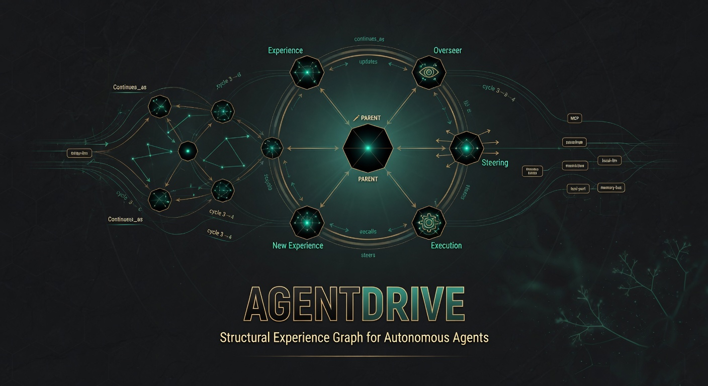

# AgentDrive

  

**The persistent, structural Experience Graph for AI agents and autonomous systems.**

Local-first. Self-referential. Built for agents that need to reason over connections, history, and their own past work — not just retrieve flat documents.

## What It Actually Is Today

AgentDrive gives agents a living, queryable **Experience Graph** (v3 multi-cycle memory fabric) — an Obsidian-style connection graph of TypedEdges, cross-cycle continuations, coherence signals, densification history, and explicit structural reasoning traces.

Key delivered surfaces:

- **Experience Graph v3** — The core structural substrate. Agents (or external LLMs via MCP) can pull dense context packs, find structural similarities across prior work, retrieve history of reasoning over specific elements, and record their own graph-native decisions.
- **Canonical 6-step loop** — Experience → RealTimeEvolutionOverseer (metacognition + structural ingestion) → Parent (decision maker that can explicitly reason over the graph) → steering → execution → new experience written back as first-class traces and edges. The Overseer serves the Parent; the Parent is the strategic decision-maker.
- **MCP server** (`experience_graph_*` tools) — Any MCP-capable model (Claude, Cursor, local models, etc.) can directly call the structural Experience Graph tools with gbrain scoring and provenance, exactly like GBrain made scored knowledge first-class. Tools include context packs, structural similarity search, recording reasoning traces, and retrieving prior graph reasoning history.
- **Mission Control (Tower + TUI)** — Real-time observability surface. Watch 6-step pulsing, live fabric updates, Parent decisions, and autonomous reasoning traces appear in the Experience Layer panel as agents work. The human operator sees the whole system as one, not scattered files.
- **Self-referential DNA** — Every run, every autonomous decision, every MCP tool call can be written back as queryable, gbrain-scored experience. Future agents (and `Drive.think`) literally stand on the shoulders of prior structural reasoning.

The drive is the environment. The Experience Graph is the memory and reasoning substrate. The 6-step loop + Recorder is the disciplined cycle. MCP is the universal interface for local and frontier models.

## Current Direction

Enabling **non-stop autonomous agents** powered by local models that:
- Connect via the `experience_graph_*` MCP tools (or direct API).
- Run continuous 6-step (or evolved) loops.
- Use the structural Experience Graph as long-term, queryable memory.
- Write every significant reasoning step back as first-class traces and edges.
- Can be given Research Constitutions / goals and left to work, with full human visibility in the Tower.

Any user with a local model (Ollama, llama.cpp, LM Studio, etc.) should be able to integrate it and have it pursue goals inside a real, evolving, structural memory system rather than a stateless tool-calling loop.

## What Came Before (Foundation)

The original durable memory vision remains the foundation:
- Three-tier Drives (Personal, Swarm, DNA) with content-addressed Genomes.
- Capability URIs, Quarantine, immune system, and lineage.
- Local-first, privacy-absolute by default.

All of that is still there and still the durable substrate. The Experience Graph is the evolutionary layer that sits on top and inside it — the part that lets agents (and autonomous systems) actually get smarter from their own structural history.

## Quick Links (Current Reality)

- Source: `src/agentdrive/evolution/experience_graph.py` + `ExperienceGraphRecorder`
- MCP surface: `src/agentdrive/adapters/mcp_server.py` (experience_graph tools)
- 6-step loop: `src/agentdrive/system/integrated_real_time_evolution_system.py`
- Mission Control Tower: `src/agentdrive/mission_control/static/index.html` + server
- All work self-recorded on the drive as living Experience Graph DNA (see `observations/`, `knowledge/edges.jsonl`, genomes on stabilization-wave-20260531).

## Status

This is production-grade infrastructure for structural, self-referential agent memory and reasoning — already exercised in extended static fires, autonomous research threads, and naming hygiene passes on the stabilization-wave-20260531 drive.

The public MCP surface, the 6-step loop, the observability layer, and the self-referential DNA system are real and in use.

## License

MIT

---

*Work on this repo is recorded as first-class Experience Graph DNA on the operator's drive. The graph names itself consistently.*
