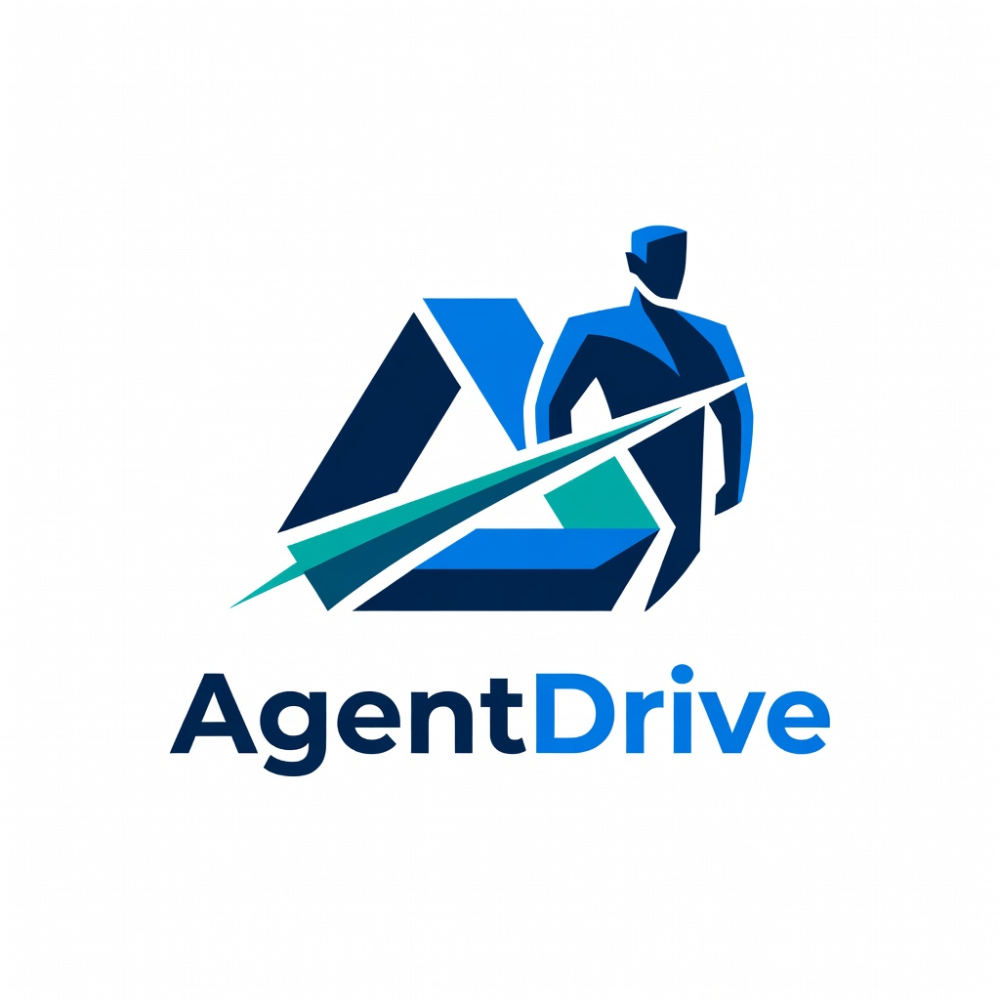
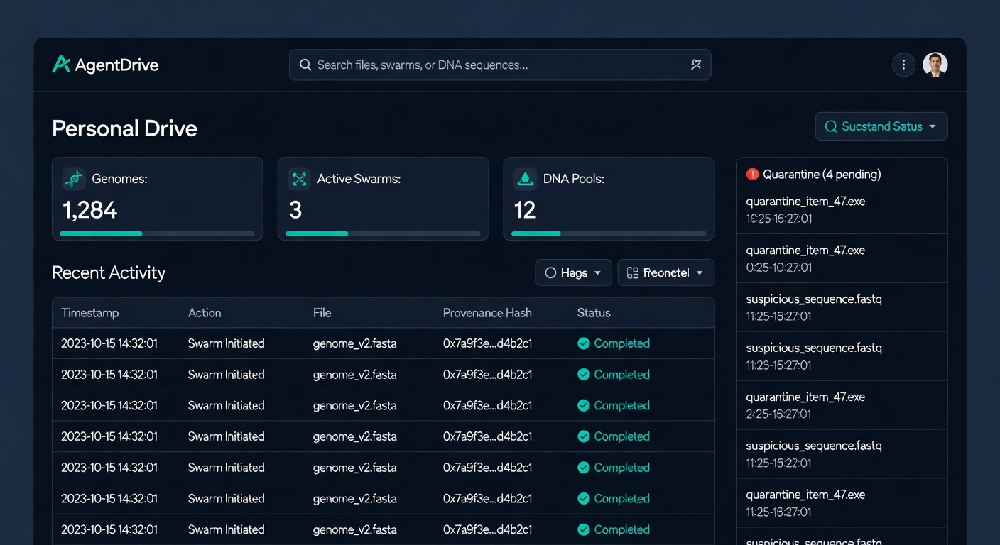
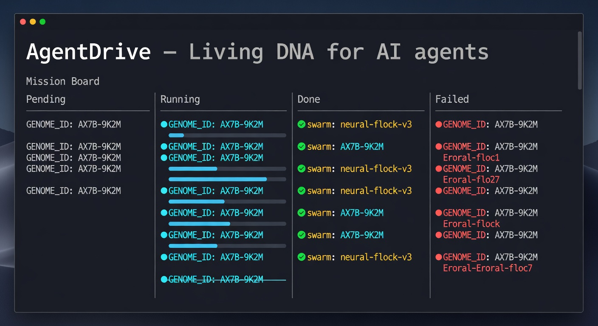
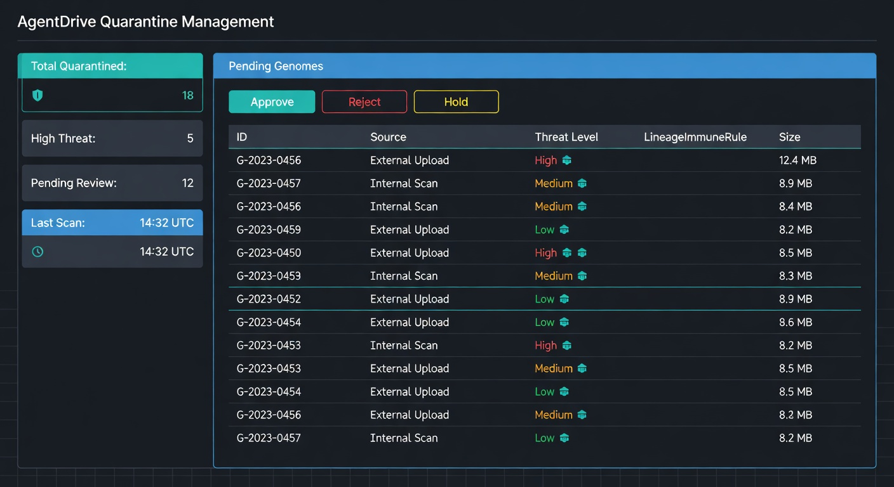

<div align="center">
  
  <br><br>
  <h1 align="center" style="margin: 0; font-size: 2.8em;">AgentDrive</h1>
  <p align="center" style="margin: 8px 0 20px; color: #64748b; font-size: 1.15em; max-width: 620px; margin-left: auto; margin-right: auto;">
    <b>Local-first storage for AI agents.</b><br>
    Three Drive tiers — Personal, Swarm, DNA — over one content-addressed object store,<br>
    protected by signed capabilities. No cloud. No vendor. You hold the keys.
  </p>
</div>

<p align="center">
  <a href="https://github.com/PabloTheThinker/AgentDrive/actions/workflows/ci.yml"></a>
  <a href="#license"></a>
  <a href="#quickstart"></a>
  <a href="https://vektraindustries.com/agentdrive"></a>
</p>

<p align="center">
  <a href="#quickstart"><b>Install</b></a> ·
  <a href="HELP.md"><b>User Manual</b></a> ·
  <a href="CONCEPTS.md"><b>Concepts</b></a> ·
  <a href="#features"><b>Features</b></a> ·
  <a href="#screenshots"><b>Screenshots</b></a>
</p>

---

## Overview

**AgentDrive** is local-first, content-addressed storage and continuity for AI agents and swarms.

It provides every agent three persistent, user-controlled Drive tiers on the operator’s machine:

- **Personal Drive** — private working memory
- **Swarm Drives** — shared coordination between sub-agents (stigmergy)
- **DNA Drives** — long-lived, forward-only inheritance of proven capabilities

All operations are protected by explicit, signed **Capability URIs**. Any genome arriving from outside your direct trust boundary is forced through **Quarantine** (with adaptive immune assessment via `LineageImmuneRule`).

AgentDrive is the durable memory and evolutionary substrate that sits *beneath* your agent runtime.

---

## Quickstart

```bash
curl -fsSL https://vektraindustries.com/agentdrive/install | bash
agentdrive
```

Or install manually:

```bash
python3 -m pip install --user git+https://github.com/PabloTheThinker/AgentDrive.git
export PATH="$HOME/.local/bin:$PATH"
agentdrive
```

Requirements: Python 3.11+ (Linux, macOS, or Windows via WSL2).

### See the system working (2 minutes)

```bash
# Basic Drive + Harness usage
python3 examples/01_hello_drive.py

# Content-addressed deduplication
python3 examples/02_dedup.py

# Swarm coordination
python3 examples/03_swarm.py

# Mandatory Quarantine + immune system
python3 examples/04_quarantine_workflow.py

# DNA, grants, and evolution cycles
python3 examples/05_lineage_dna_grants.py

# High-continuity operator bridge (publish your own research as inheritable DNA)
python3 examples/11_high_continuity_bridge_demo.py
```

All examples are safe and only write to isolated locations.

Full guided tour and explanations: [`docs/INTEGRATION.md`](docs/INTEGRATION.md) and the `examples/` directory.

---

## Screenshots

<div align="center">
  
  <br><sub>Web dashboard — Drives, Swarms, DNA, Quarantine, and Capabilities</sub>
</div>

<br>

<div align="center">
  
  <br><sub>Terminal UI — Mission Board with full provenance</sub>
</div>

<br>

<div align="center">
  
  <br><sub>Quarantine interface with LineageImmuneRule assessment</sub>
</div>

---

## Features

| Feature                        | Status     | Notes |
|--------------------------------|------------|-------|
| Three Drive Tiers (Personal / Swarm / DNA) | Shipped | Clear boundaries and semantics |
| Content-Addressed Object Store | Shipped | SHA-256 identity + machine-wide deduplication |
| Capability URIs                | Shipped | Ed25519, TTL-bounded, single verification point |
| Quarantine + LineageImmuneRule | Shipped | Mandatory gate with adaptive threat memory and lineage self-tolerance |
| DNA Drives + Lineage Grants    | Shipped | Forward-only ancestry + signed cross-agent grants |
| Reconciliation & Healing       | Shipped | Background awareness + recovery using high-confidence DNA |
| Harness + Adapters             | Shipped | Clean integration for external agent runtimes |
| Web Dashboard + TUI            | Shipped | Full operator interface |
| High-Continuity Operator Bridge | Optional (advanced) | `GrokPatternLineageBridge` — publish patterns from external research indexes as first-class Genomes |
| DNA Evolution Engine           | Optional (advanced) | `LineageDNAEvolver` — Research → Evaluate → Evolve using native sources + optional external indexes |

---

## Architecture

AgentDrive separates concerns that have fundamentally different lifetimes and trust models:

- **Personal Drive** — private, mutable, owner-only
- **Swarm Drive** — shared within a mission (stigmergic)
- **DNA Drive** — long-lived, append-only inheritance

All three tiers write to the same content-addressed store and are mediated by signed capabilities.

See [`CONCEPTS.md`](CONCEPTS.md) for the full mental model.

---

## Documentation

**Start here:** [HELP.md](HELP.md) — the official, comprehensive user manual.

Other key documents:
- [CONCEPTS.md](CONCEPTS.md) — Architecture and design philosophy
- [docs/INTEGRATION.md](docs/INTEGRATION.md) — How to integrate AgentDrive with your agents

---

## Status & Quality

**Version:** 0.2.0

**Quality gates:**
- `pytest` passes
- `ruff` clean on source and tests
- CI includes pytest, ruff, and CodeQL

---

## License

MIT.

See [LICENSE](LICENSE) for details.