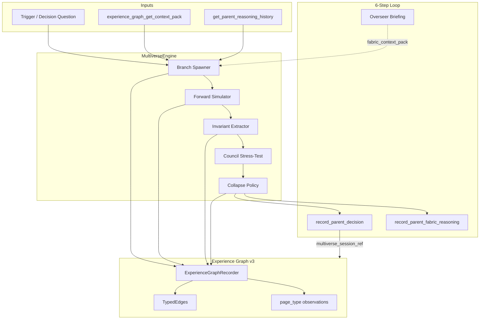

# Multiverse Cognition — Deep Integration into AgentDrive

> **Status:** Design + module skeleton (`agentdrive.cognition.multiverse`)  
> **Drive context:** `stabilization-wave-20260531`  
> **Origin:** Cognitive Agent Team framework + AD-Grid Experience Graph v3

---

## What This Is

**Multiverse Cognition** is AgentDrive's first-class operational mode for holding **superposition of competing futures** until structure crystallizes, then **collapsing** into a governed Parent decision — with every branch, invariant, and collapse recorded as queryable Experience Graph DNA.

It is not a new loop. It is a **cognitive substrate** that plugs into the sacred 6-step canonical order:

```
Experience → Overseer → Parent (multiverse here) → Steering → Execution → New Experience
```

The Parent does not think linearly. It:
1. Spawns parallel timelines (branches)
2. Simulates each forward
3. Extracts cross-branch invariants (load-bearing truths)
4. Stress-tests via Council / role agents
5. Collapses to one path
6. Records the full multiverse session as fabric DNA

Philosophy: *"See a path, secure a path"* — superposition is for **finding**; collapse is **immediate** once the pattern clicks.

---

## Architectural Placement in AD-Grid



| AD subsystem | Role in multiverse |
|---|---|
| **Experience Graph v3** | Primary memory — branches, invariants, collapses as TypedEdges + observations |
| **Parent / Overseer loop** | Multiverse runs inside Parent decision; Overseer consumes collapsed invariants in next briefing |
| **AD-Grid Council** | Guardian gates collapse; Adversary stress-tests; ExternalBridge grounds branches in external signals |
| **Research threads** | Long-horizon multiverse sessions become durable research-thread manifests |
| **MultiMetricEvaluationHarness** | Scores branch robustness (contradiction_reduction, resilience_lift, future_prediction_power) |
| **GridEngine** | Background multiverse densification on stale superposition sessions |
| **MCP / Operations registry** | `multiverse_*` tools for any connected model |

---

## Core Data Model

### MultiverseSession

One superposition episode tied to a `cycle_id` and `correlation_id`.

```python
MultiverseSession:
  session_id: str           # multiverse-session:{ts}
  trigger: str              # the decision question
  cycle_id: str
  correlation_id: str
  program_id: str | None    # AD-Grid inhabitant attribution
  constitution_refs: list[str]
  user_objective_refs: list[str]
  status: open | collapsed | reopened
  branches: list[Branch]
  invariants: list[Invariant]
  convergence_points: list[str]
  divergence_points: list[str]
  collapsed_branch_id: str | None
  collapse_reason: str | None
  collapse_policy: str      # pattern_crystallized | adversary_clear | harness_score | conductor_override
```

### Branch

One parallel timeline.

```python
Branch:
  branch_id: str
  role: str                 # architect | adversary | scout | operator | surgeon | beacon | watchdog | custom
  path_summary: str
  assumptions: list[str]
  divergence_axes: list[str]  # risk | speed | reversibility | cost | dependency_order
  forward_steps: list[ForwardStep]
  robustness_score: float     # 0-1, fraction of sibling branches where assumptions hold
  fragility_flags: list[str]
  stress_test: AdversaryVerdict | None
```

### Invariant

Load-bearing truth that survives across branches.

```python
Invariant:
  statement: str
  branch_coverage: float    # e.g. 0.8 = present in 8/10 branches
  kind: robust | fragile | convergence | divergence
```

---

## Experience Graph TypedEdge Relations (New)

Registered in `agentdrive.cognition.multiverse` and dual-written via `ExperienceGraphRecorder.record_connection`:

| Relation | Inverse | Meaning |
|---|---|---|
| `multiverse_session` | `session_contains_multiverse` | Cycle/decision anchors a superposition session |
| `branch_spawned` | `spawned_in_multiverse` | Session spawned a parallel branch |
| `branch_simulated_forward` | `forward_simulation_of_branch` | Branch has N-step forward projection |
| `invariant_extracted` | `invariant_of_multiverse` | Cross-branch load-bearing truth |
| `convergence_detected` | `converges_via_multiverse` | Multiple paths → same outcome |
| `divergence_detected` | `diverges_at_multiverse_point` | Small delta → large outcome split |
| `path_collapsed` | `collapsed_from_multiverse` | Parent committed to one branch |
| `branch_stress_tested` | `stress_test_on_branch` | Adversary pre-mortem on branch |
| `multiverse_informed_decision` | `decision_informed_by_multiverse` | Links collapse → `record_parent_decision` |

All edges carry `gbrain_signal_score` in metadata. High-coverage invariants (>0.7) boost Overseer briefing source_boost.

### page_type Observations

| page_type | When written |
|---|---|
| `multiverse-session` | Session open/close |
| `multiverse-branch` | Each branch spawned + simulated |
| `multiverse-invariants` | After invariant extraction |
| `multiverse-collapse` | On path collapse |
| `multiverse-council-verdict` | Guardian/Adversary gates |

Stored under `observations/meta-evolution/multiverse/`.

---

## The Multiverse Pipeline (7 phases)

### Phase 1 — Gather (Experience)

Before spawning branches, Parent pulls structural context:

```python
pack = recorder.get_fabric_context_pack(lookback_cycles=5)
history = recorder.get_recent_parent_fabric_reasoning_traces(lookback=3)
prior_multiverse = recorder.find_structural_similarities(
    pattern="multiverse_session",
    element_id=trigger_slug,
)
```

MCP equivalents: `experience_graph_get_context_pack`, `experience_graph_get_parent_reasoning_history`, `experience_graph_find_structural_similarities`.

### Phase 2 — Spawn (Branch Generator)

`MultiverseEngine.spawn_branches()` creates N orthogonal branches.

**Orthogonality enforcement** — each branch must differ on ≥1 divergence axis:

| Axis | Example branch A | Example branch B |
|---|---|---|
| `risk` | Ship fast, accept breakage | Gate behind feature flag |
| `speed` | MVP in 2 days | Full architecture first |
| `reversibility` | Reversible DB migration | One-way cutover |
| `cost` | Free tier only | Paid infra from day 1 |
| `dependency_order` | Backend-first | UI-first probe |

**Role-based spawning** (Cognitive Agent Team integration):

| Role | Branch lens |
|---|---|
| Architect | Structural skeleton paths |
| Adversary | Pre-mortem failure timelines |
| Scout | Intelligence-gap scenarios |
| Operator | Ship-velocity sequences |
| Surgeon | Minimal intervention points |
| Beacon | Distribution/propagation paths |
| Watchdog | Attack-path / security timelines |

Default: 7 branches (one per role) or `n_branches` with round-robin roles.

### Phase 3 — Simulate Forward

Each branch rolled forward `forward_steps` (default 3):

```
Step 1: immediate consequence
Step 2: second-order effect
Step 3: compound outcome / equilibrium
```

Implementation tiers:
- **Tier 0 (skeleton):** Heuristic templates in `multiverse.py` (runnable now)
- **Tier 1:** LLM simulation via Harness compose + constitution prompt
- **Tier 2:** Real execution probes (`build to understand`) on collapsed candidate only

### Phase 4 — Extract Invariants

`extract_invariants(branches)` computes:

- **Robust** — assumption/outcome in ≥70% of branches
- **Fragile** — true in exactly one branch
- **Convergence** — different paths, same destination statement
- **Divergence** — shared prefix, outcome fork at step K

Outputs feed Overseer's next `get_parent_actionable_briefing` as `multiverse_invariants` block.

### Phase 5 — Council Stress-Test

Before collapse, Adversary role (or `agentdrive_get_council_activity` Adversary traces) runs pre-mortem on top-2 branches by robustness:

```python
verdict = engine.stress_test_branch(branch_id, adversary_prompt=...)
# Records branch_stress_tested edge + multiverse-council-verdict observation
```

GuardianIntegrity can **veto collapse** if collapse would violate sovereignty (e.g. silent auto-promotion path selected).

### Phase 6 — Collapse

`CollapsePolicy` enum:

| Policy | Trigger |
|---|---|
| `pattern_crystallized` | Top branch robustness ≥ 0.75 AND shares ≥2 invariants with runner-up |
| `adversary_clear` | Top branch passes stress-test; runner-up fails |
| `harness_score` | MultiMetricEvaluationHarness keep on collapsed path |
| `conductor_override` | Human explicit choice (audited DNA) |
| `budget_exhausted` | Max superposition time/steps hit → pick highest robustness |

On collapse:
```python
engine.collapse(session_id, branch_id, reason="pattern_crystallized")
# → path_collapsed edge
# → multiverse_informed_decision edge to parent_decision slug
# → fabric_reasoning payload for record_parent_fabric_reasoning
```

### Phase 7 — Write Back (New Experience)

```python
integrated.record_parent_decision(
    cycle_id,
    decision={"directive": collapsed.path_summary, "multiverse_session_id": session_id},
    fabric_reasoning=engine.to_fabric_reasoning(session),
)
```

`to_fabric_reasoning()` shape:
```json
{
  "fabric_elements_considered": ["multiverse-session:...", "invariant:...", "branch:..."],
  "structural_pattern_matched": "multiverse_cognition:robust_invariant_coverage_0.82",
  "decision_rationale": "Collapsed to Operator-path; survives 6/7 timelines; Adversary clear.",
  "expected_lift_signal": 0.06,
  "multiverse_session_id": "multiverse-session:1780...",
  "invariants": ["..."],
  "collapse_policy": "pattern_crystallized"
}
```

---

## MCP / CLI Surface

New operations in `agentdrive.operations.registry`:

| Operation | MCP tool | Read-only |
|---|---|---|
| `multiverse_spawn` | `multiverse_spawn_session` | false |
| `multiverse_simulate` | `multiverse_simulate_branches` | false |
| `multiverse_invariants` | `multiverse_extract_invariants` | true |
| `multiverse_stress_test` | `multiverse_stress_test_branch` | false |
| `multiverse_collapse` | `multiverse_collapse_path` | false |
| `multiverse_status` | `multiverse_get_session` | true |
| `multiverse_run` | `multiverse_run_full` | false |

**`multiverse_run_full`** — one-shot: spawn → simulate → invariants → stress-test → collapse → record. Primary tool for MCP clients.

CLI:
```bash
agentdrive multiverse run --trigger "How should we ship feature X?" --branches 7
agentdrive multiverse status --session multiverse-session:1780...
agentdrive multiverse collapse --session ... --branch branch:operator-2
```

---

## Integration with Cognitive Agent Team

The seven agents are **branch generators**, not separate loops. One `MultiverseEngine` session spawns role-labeled branches:

```
trigger: "Should we migrate auth to Clerk?"
├── branch:architect-1  → structural migration skeleton
├── branch:adversary-1  → timeline where migration leaks sessions
├── branch:scout-1      → unknown SSO edge cases
├── branch:operator-1   → phased rollout sequence
├── branch:surgeon-1    → minimal cutover point
├── branch:beacon-1     → user comms / downtime narrative
└── branch:watchdog-1   → attack surface during transition
```

Constitution genome: `research-constitution-multiverse-cognition@stabilization-wave-20260531.json`

Ingest:
```bash
agentdrive drive ingest genomes/examples/research-constitution-multiverse-cognition@stabilization-wave-20260531.json
```

---

## Integration with Research Threads

Long-running decisions become research threads:

1. `multiverse_spawn` with `durable=True` creates a `research-thread-manifest` linked via `multiverse_session` edge
2. GridEngine research-thread pass picks up open superposition sessions older than `config.multiverse_reopen_after_s`
3. New evidence triggers `status=reopened` → partial re-collapse
4. MultiMetricEvaluationHarness scores whether reopening reduced contradiction vs prior collapse

---

## Overseer Consumption

`get_parent_actionable_briefing()` extended (future tranche) with:

```json
{
  "multiverse_context": {
    "recent_collapses": [...],
    "open_superposition": [...],
    "top_invariants_from_last_3_sessions": [...],
    "robustness_trend": 0.04
  }
}
```

Overseer metacognition can flag: *"Parent collapsed too early — 3 branches never simulated"* or *"Invariant X appeared in 4 consecutive multiverse sessions — promote to genome pattern"*.

---

## File Layout

```
src/agentdrive/cognition/
  __init__.py              # public exports
  multiverse.py            # MultiverseEngine, relations, collapse policy
  roles.py                 # Cognitive Agent Team role prompts (future)

genomes/examples/
  research-constitution-multiverse-cognition@stabilization-wave-20260531.json

examples/
  12_multiverse_cognition_loop.py   # runnable smoke against real recorder

docs/
  MULTIVERSE_COGNITION.md  # this document
```

---

## Runnable Smoke

```bash
cd "/home/pablothethinker/Vektra Industries/Software/AgentDrive"
PYTHONPATH=src python examples/12_multiverse_cognition_loop.py --trigger "Ship multiverse cognition MVP"
```

Writes real `multiverse-session` observations + TypedEdges to the stabilization-wave drive.

---

## Implementation Tranches

| Tranche | Scope | Status |
|---|---|---|
| **M0** | Design doc + `multiverse.py` skeleton + example + constitution genome | **Done** |
| **M1** | MCP tools + CLI `agentdrive multiverse` + `run_multiverse_parent_decision` + briefing `multiverse_context` + session persistence | **Done** |
| **M2** | `LLMBranchSpawner` + `roles.py` — local model when available, heuristic fallback | **Done** |
| **M3** | `densify_invariant_clusters()` — GraphGardener edges on robust invariants | **Done** |
| **M4** | Durable `research-thread-manifest` + `reopen_stale_sessions()` | **Done** |
| **M5** | Mission Control Tower panel + `MultiverseUpdateEvent` | **Done** |

---

## For AI Models Using AgentDrive

When facing a non-trivial decision:

1. `experience_graph_get_context_pack` — gather fabric
2. `multiverse_run_full` — spawn, simulate, extract, stress-test, collapse
3. `experience_graph_record_reasoning` — record structural rationale
4. `record_parent_decision` equivalent via Integrated — commit with `fabric_reasoning`
5. Execute the collapsed path; log outcome via `agentdrive_record_outcome`

Do not collapse before invariants are named. Do not spawn branches that differ only in wording.

---

## References

- Cognitive Agent Team: `~/Documents/cognitive-agent-team/architect-cognition-agent.md`
- Experience Graph v3: `src/agentdrive/evolution/experience_graph.py`
- 6-step loop: `src/agentdrive/system/integrated_real_time_evolution_system.py`
- AD-Grid vision: `docs/AD_GRID_VISION.md`
- Autonomous loop example: `examples/autonomous_experience_graph_agent_loop.py`